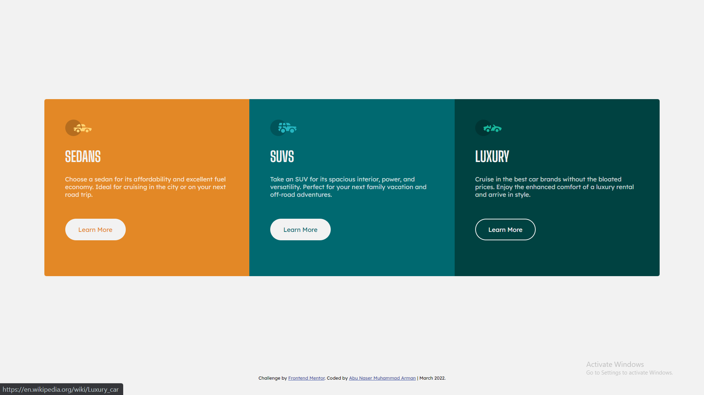

# As Salamu Alaikum! 👋 

This is my solution to the [3-column preview card component challenge on Frontend Mentor](https://www.frontendmentor.io/challenges/3column-preview-card-component-pH92eAR2-).
## Table of contents

- [As Salamu Alaikum! 👋](#as-salamu-alaikum-)
  - [Table of contents](#table-of-contents)
  - [Overview](#overview)
    - [The challenge was:](#the-challenge-was)
    - [Screenshot](#screenshot)
    - [Links](#links)
    - [Built with](#built-with)
    - [What I learned](#what-i-learned)
    - [Resources](#resources)
  - [Acknowledgement](#acknowledgement)
  - [Get Connected](#get-connected)


## Overview

### The challenge was:

Users should be able to..

- View the optimal layout depending on their device's screen size
- See hover states for interactive elements

### Screenshot



### Links

- [Solution](https://www.frontendmentor.io/solutions/solution-to-3column-previewcard-component-challenge-using-flexbox-h-YuBCn58)
- [Live site](https://arman-anm.github.io/3-column-preview-card-component/)

### Built with

- Semantic HTML5 markup
- CSS custom properties
- Flexbox
- Mobile-first workflow

### What I learned

```css
/* In CSS */

ELEMENT > element {
  padding: 10px;
}

/* Is not the same as  */

ELEMENT element {
 padding: 10px
}
```

The first one is [Direct child Selector](https://www.w3schools.com/css/css_combinators.asp) & the second one is [Descendant Selector](https://www.w3schools.com/css/css_combinators.asp). 

In one line of my code I've used
```css
.wrapper-cards * {
  padding: calc(var(--padding-default) * 2);
}
```
and expected to have some padding to the child cards of the wrapper. Which of course didn't happen. Instead it applied padding to all the elements. Then i've added one single character to the code;
```css
.wrapper-cards > * {
  padding: calc(var(--padding-default) * 2);
}
```
 Literally just ONE character which is '>' and voila, it fixed my broken page instantly. 
 
Now, should i get amazed about how powerful just one piece of character is? Or get freaked out about how powerful just ONE piece of character is?

### Resources

- [Big Shoulders Display Font](https://fonts.google.com/specimen/Big+Shoulders+Display) - The font used in my Heading texts
- [Lexend Deca Font](https://fonts.google.com/specimen/Lexend+Deca) - Used in Paragraph.

- [CSS Cheatsheet by Kyle](https://webdevsimplified.com/specificity-cheat-sheet.html) - Helped me understand CSS selectors.
- [W3School's CSS Combinator Reference Page](https://www.w3schools.com/css/css_combinators.asp) - A good guide to CSS combinators & also gives chance to play with them in it's great 'Tryit Editor'. 

## Acknowledgement
- Thanks to [Alazar Getachew](https://github.com/AlazarG19) for giving me valuable [feedbacks](https://www.frontendmentor.io/solutions/solution-to-3column-previewcard-component-challenge-using-flexbox-h-YuBCn58#comment-623850e08a1c69047217f8ab) after submitting my solution to Frontend Mentor 🙂

- Thanks to [Kyle Cook](https://www.youtube.com/c/WebDevSimplified/videos) for creating such a nice [handbook](https://webdevsimplified.com/specificity-cheat-sheet.html) on CSS selector 🙂

## Get Connected 

- Facebook - [Abu Naser Muhammad Arman](https://www.facebook.com/armaan.anm)
- Instagram - [@arman_anm](https://www.instagram.com/arman_anm/)
- Twitter - [@arman_anm](https://twitter.com/arman_anm)
- Gmail - <armaan.anm@gmail.com>