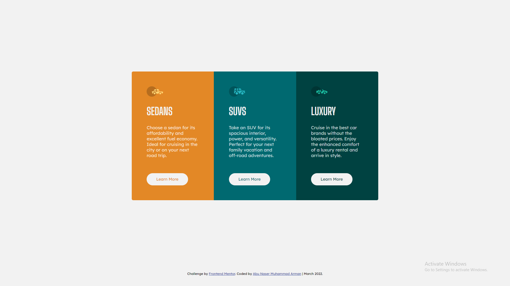

# As Salamu Alaikum! 👋 

This is my solution to the [3-column preview card component challenge on Frontend Mentor](https://www.frontendmentor.io/challenges/3column-preview-card-component-pH92eAR2-).
## Table of contents

- [As Salamu Alaikum! 👋](#as-salamu-alaikum-)
  - [Table of contents](#table-of-contents)
  - [Overview](#overview)
    - [The challenge was:](#the-challenge-was)
    - [Screenshot](#screenshot)
    - [Links](#links)
    - [Built with](#built-with)
    - [What I learned](#what-i-learned)
    - [External Resources](#external-resources)
  - [Get Connected](#get-connected)
  - [Acknowledgement](#acknowledgement)


## Overview

### The challenge was:

Users should be able to..

- View the optimal layout depending on their device's screen size
- See hover states for interactive elements

### Screenshot



### Links

- [Solution](https://www.frontendmentor.io/solutions/solution-to-3column-previewcard-component-challenge-using-flexbox-h-YuBCn58)
- [Live site](https://arman-anm.github.io/3-column-preview-card-component/)

### Built with

- Semantic HTML5 markup
- CSS custom properties
- Flexbox
- Mobile-first workflow

### What I learned


```html
<h1></h1>
```
```css
.css {
  color: black;
}
```

### External Resources

- [Big Shoulders Display](https://fonts.google.com/specimen/Big+Shoulders+Display) - The font used in my Heading texts
- [Lexend Deca](https://fonts.google.com/specimen/Lexend+Deca) - Used in Paragraph.


## Get Connected 

- Facebook - [Abu Naser Muhammad Arman](https://www.facebook.com/armaan.anm)
- Instagram - [@arman_anm](https://www.instagram.com/arman_anm/)
- Twitter - [@arman_anm](https://twitter.com/arman_anm)
- Gmail - <armaan.anm@gmail.com>

## Acknowledgement
- Thanks to [Alazar Getachew](https://github.com/AlazarG19) for giving me valuable [feedbacks](https://www.frontendmentor.io/solutions/solution-to-3column-previewcard-component-challenge-using-flexbox-h-YuBCn58#comment-623850e08a1c69047217f8ab) after submitting my solution to Frontend Mentor 🙂